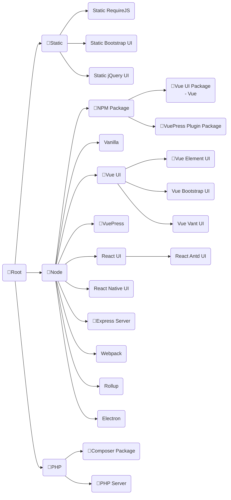

```mermaid
flowchart LR
Root("🚀Root")
	click Root "https://github.com/langnang-temp/root"

Root-->Static("🚀Static")
	click Static "https://github.com/langnang-temp/static"
	Static-->Static_RequireJS("Static RequireJS")
	Static-->Static_Bootstrap_UI("Static Bootstrap UI")
	Static-->Static_jQuery_UI("Static jQuery UI")
Root-->Node("🚀Node")
	click Node "https://github.com/langnang-temp/node"
	Node-->NPM_Package("🚀NPM Package")
		click NPM_Package "https://github.com/langnang-temp/npm-package"
		NPM_Package-->Vue_UI_Package("🚀Vue UI Package \n- Vue ")
			click Vue_UI_Package "https://github.com/langnang-temp/vue-ui-package"
		NPM_Package-->VuePress_Plugin_Package("🚀VuePress Plugin Package")
			click VuePress_Plugin_Package "https://github.com/langnang-temp/vuepress-plugin-package"
	Node-->Vanilla("Vanilla")
	Node-->Vue_UI("🚀Vue UI")
		click Vue_UI "https://github.com/langnang-temp/vue-ui"
		Vue_UI-->Vue_Element_UI("🚀Vue Element UI")
			click Vue_Element_UI "https://github.com/langnang-temp/vue-element-ui"
		Vue_UI-->Vue_Bootstrap_UI("Vue Bootstrap UI")
		Vue_UI-->Vue_Vant_UI("Vue Vant UI")
	Node-->VuePress("🚀VuePress")
		click VuePress "https://github.com/langnang-temp/vuepress"
	Node-->React_UI("React UI")
		React_UI-->React_Antd_UI("React Antd UI")
	Node-->React_Native_UI("React Native UI")
	Node-->Express_Server("🚀Express Server")
		click Express_Server "https://github.com/langnang-temp/express-server"
	Node-->Webpack("Webpack")
	Node-->Rollup("Rollup")
	Node-->Electron("Electron")

Root-->PHP("🚀PHP")
	click PHP "https://github.com/langnang-temp/php"
	PHP-->Composer_Package("🚀Composer Package")
	click Composer_Package "https://github.com/langnang-temp/composer-package"
	PHP-->PHP_Server("🚀PHP Server")
		click PHP_Server "https://github.com/langnang-temp/php-server"
```
