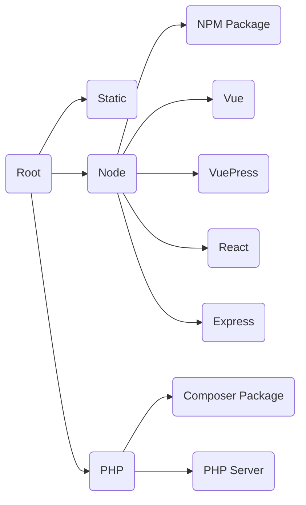

```mermaid
flowchart LR
Root(Root)
	click Root "https://github.com/langnang-temp/root"

Root-->Static(Static)
	click Static "https://github.com/langnang-temp/static"

Root-->Node(Node)
	click Node "https://github.com/langnang-temp/node"
	Node-->NPM_Package("NPM Package")
	Node-->Vue(Vue)
	Node-->VuePress(VuePress)
	Node-->React(React)
	Node-->Express(Express)

Root-->PHP(PHP)
	click PHP "https://github.com/langnang-temp/php"
	PHP-->Composer_Package("Composer Package")
	PHP-->PHP_Server("PHP Server")
```
