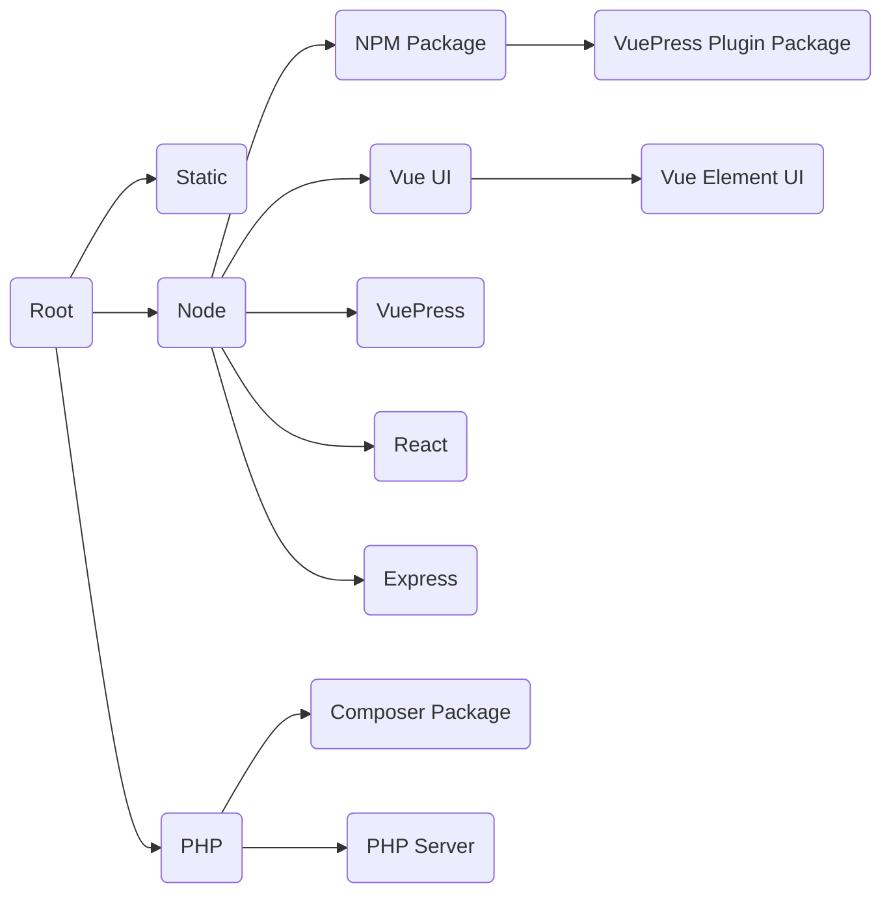

```mermaid
flowchart LR
Root(Root)
	click Root "https://github.com/langnang-temp/root"

Root-->Static(Static)
	click Static "https://github.com/langnang-temp/static"

Root-->Node(Node)
	click Node "https://github.com/langnang-temp/node"
	Node-->NPM_Package("NPM Package")
		click NPM_Package "https://github.com/langnang-temp/npm-package"
		NPM_Package-->VuePress_Plugin_Package("VuePress Plugin Package")
		click VuePress_Plugin_Package https://github.com/langnang-temp/vuepress-plugin-package
	Node-->Vue_UI("Vue UI")
		click Vue_UI "https://github.com/langnang-temp/vue-ui"
		Vue_UI-->Vue_Element_UI("Vue Element UI")
			click Vue_Element_UI "https://github.com/langnang-temp/vue-element-ui"
	Node-->VuePress(VuePress)
		click VuePress "https://github.com/langnang-temp/vuepress"
	Node-->React(React)
	Node-->Express(Express)

Root-->PHP(PHP)
	click PHP "https://github.com/langnang-temp/php"
	PHP-->Composer_Package("Composer Package")
	PHP-->PHP_Server("PHP Server")
		click PHP_Server "https://github.com/langnang-temp/php-server"
```
